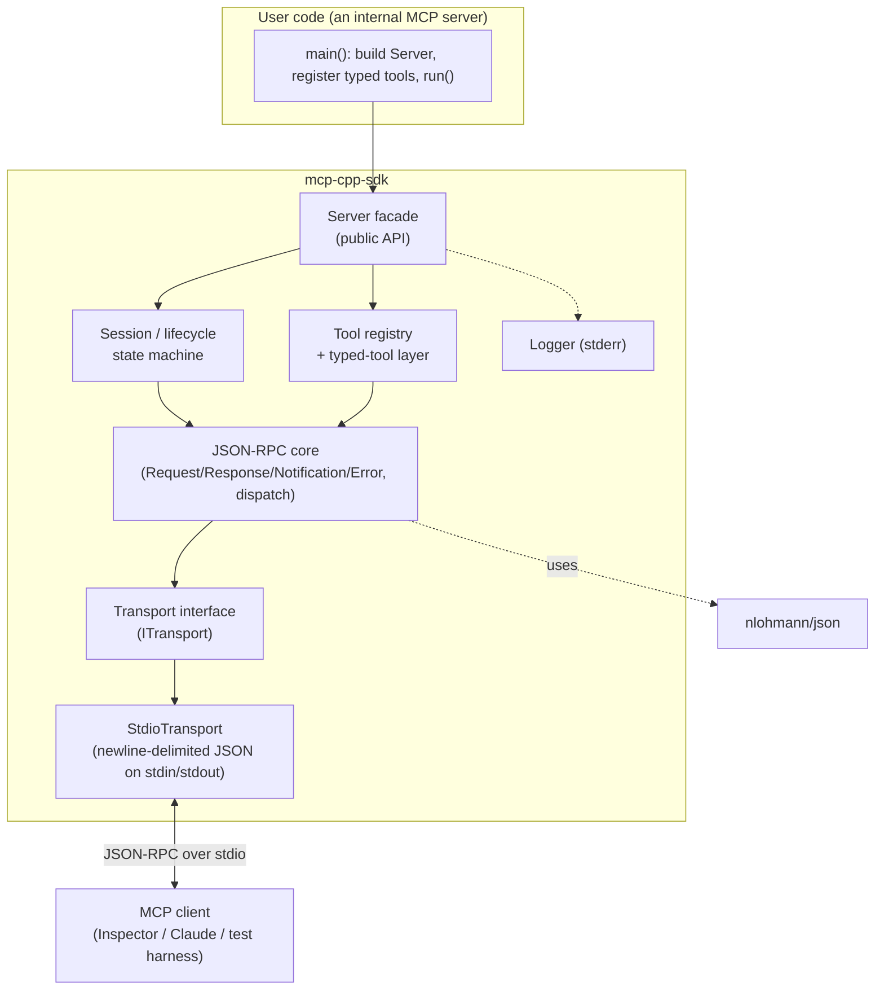

# MCP C++ SDK — Design & Learning Plan

*Working title:* **`mcp-cpp-sdk`** — a small, modern-C++20 SDK for building Model Context Protocol servers internally, designed as much to *teach C++* as to ship working servers.

*Status:* planning (this document). Implementation happens in `mcp-cpp-sdk/` via Claude Code, one milestone at a time.

*Last updated:* 2026-07-22

---

## 1. What we're building and why

We want a library that an internal team can link against and, in a few lines of clear C++, stand up an MCP server exposing their own tools. Two goals, equal weight:

1. **Useful** — a real, spec-correct MCP server SDK we can reuse across internal projects.
2. **Pedagogical, by doing** — this is the language Bernardo wants to be genuinely hard to beat at, so the point is not to *receive* a working SDK but to *write* it. The default is: Claude hands over a small, well-scoped coding task; Bernardo attempts it himself; if he gets stuck, Claude diagnoses the specific problem, teaches the underlying concept, and only then do we move on — together. Claude scaffolds, reviews, and unblocks; Bernardo writes the load-bearing code. Every layer is something we build ourselves and understand, chosen to exercise modern C++: RAII and ownership, templates and concepts, `std::variant`/`std::optional`, error-handling strategy, threading, and modern CMake/tooling. Clarity over cleverness, in stages so each stage teaches one idea.

**We move slowly on purpose.** Unlike the Pricebook (Python) project, where Claude Code did the bulk of the writing, here the human is in the loop on every non-trivial line. Slower throughput is the intended cost of building deep C++ fluency.

### Decisions locked in (from our planning session)

| Decision | Choice | Why |
|---|---|---|
| Language standard | **C++20** | Concepts, ranges, `std::format`, designated initializers; well supported by current clang/gcc on macOS. |
| Shape | **Library first, plugins later** | Get a linkable SDK working end-to-end before taking on dynamic-loading complexity. |
| Build-vs-reuse | **Hand-roll the protocol, reuse JSON** | We write JSON-RPC framing, dispatch, session lifecycle and the typed-tool layer ourselves; nlohmann/json does parsing. Best learning-per-effort. |
| First milestone | **stdio + tools only** | Smallest slice that works with a real MCP client. |
| Working model | **Learn-by-doing: Bernardo codes, Claude tutors** | C++ mastery is the goal; the human writes the load-bearing code, Claude teaches when he's stuck. |
| Version control | **Feature branches, small commits, PRs → GitHub** | Same disciplined git flow as Pricebook; the repo will be published. |

---

## 2. What the four reference projects taught us

We studied all four before designing anything. Short version:

- **cpp-mcp** — friendliest developer experience. A tool is a `std::function<json(json, session_id)>`; a fluent `tool_builder` describes the schema; `register_tool(tool, handler)` wires it. C++17, nlohmann/json, exceptions, stdio + HTTP/SSE. **Weakness we will fix:** schema and handler are declared in two disconnected places and everything is stringly-typed `json`, so a mismatched parameter name only fails at runtime.
- **TinyMCP** — most *complete* protocol implementation (cancellation, progress, subscriptions, pagination) and a gallery of GoF patterns (Singleton, Prototype/`Clone`, State machine). But C++11-era: `goto` cleanup, `int` error codes, jsoncpp, Hungarian notation, and a **singleton session** that only models one connection. We borrow its *internal* rigour (explicit lifecycle state machine, task dispatch) while rejecting its ceremony and its singletons.
- **mcp_server** — a plugin host: teams drop `.so`/`.dll` plugins that talk to the core over a pure `extern "C"` C ABI. The **cross-compiler isolation** idea is genuinely valuable and is why "plugins later" is on the roadmap. But raw C-ABI ownership (`new char[]` handed across the boundary with no matching free), per-plugin (not per-tool) routing, and unguarded exceptions crossing `extern "C"` make it advanced and hazardous — a later phase, done carefully.
- **mcp-cpp** — actually Rust (a clangd-backed code-intelligence server), so not an SDK reference, but its **operational conventions** are worth copying wholesale: stderr-only logging under stdio (stdout is the protocol channel — printing to it corrupts the JSON-RPC stream, the #1 beginner bug), CLI-flags-override-env config precedence, and a language-agnostic external harness that pipes JSON-RPC into the server exactly like a real client.

**The one insight that shapes our design:** all four let the tool's JSON schema drift from the code that reads its arguments. Our signature feature is a **typed-tool layer** where a single C++ definition *generates the schema and parses the arguments*, so they cannot disagree. This is both better engineering and our richest C++ teaching vehicle.

---

## 3. Protocol scope

Target MCP revision **2025-06-18** (current stable; a 2026 release candidate exists but we pin a stable revision). Transport: **stdio first**; Streamable HTTP is a later phase (the old HTTP+SSE transport was superseded in 2025-03-26, so we skip it entirely).

Message surface we implement, in order:

- JSON-RPC 2.0 envelope: requests (with `id`), responses (result/error), notifications (no `id`).
- Lifecycle: `initialize` request/response handshake, `notifications/initialized`, capability negotiation, `ping`.
- Tools: `tools/list`, `tools/call`.
- Errors: JSON-RPC error objects with the standard codes plus MCP conventions.
- Later phases: `resources/*`, `prompts/*`, progress/cancellation notifications, logging notifications, Streamable HTTP, plugin host.

---

## 4. Architecture

We separate the SDK into layers with clean seams, so each can be built and tested on its own and each maps to a teaching topic.



Layer by layer:

- **Transport (`ITransport`)** — an interface with `read()` / `write()` returning/consuming one complete JSON-RPC *message* (framing handled here). First implementation `StdioTransport` reads newline-delimited JSON from stdin and writes to stdout. Keeping this an interface (rather than hard-coding stdio) is what lets Streamable HTTP slot in later without touching the layers above. Teaching topics: abstract interfaces, RAII around file handles, the stdout-is-sacred rule.
- **JSON-RPC core** — value types `Request`, `Response`, `Notification`, `Error`, plus `Id` (a `std::variant<int64_t, std::string, std::monostate>`), and a `Dispatcher` that routes an incoming method name to a registered handler and marshals results/errors back. Teaching topics: `std::variant`/`std::optional`, `to_json`/`from_json` via nlohmann's ADL hooks, designing small value types.
- **Session / lifecycle** — an explicit state machine (`Uninitialized → Initializing → Ready → ShuttingDown`) that enforces the handshake (no `tools/call` before `initialized`), holds negotiated capabilities and server info, and owns the registries. Improves on TinyMCP by being a *per-connection object*, not a global singleton. Teaching topics: state machines, invariants, why singletons hurt.
- **Tool registry + typed-tool layer** — the heart. A `ToolRegistry` maps name → tool. Two ways to define a tool:
  - *Raw* (available first, kept as an escape hatch): a handler taking and returning `json`.
  - *Typed* (the centerpiece): you define an args struct and describe its fields once; the SDK derives the JSON schema *and* the argument-parsing from that single description, and hands your handler a fully-typed, validated struct. Teaching topics: templates, concepts, compile-time field description, `if constexpr`.
- **Server facade** — the small, friendly public surface users actually write against (see §5). Owns a transport and a session, exposes `register_tool(...)` and `run()`.
- **Logger** — a trivial stderr logger with levels. Teaching topic: the stdio/stdout hazard, made concrete.
- **Config** — CLI flags overriding env vars (borrowed from mcp-cpp) for log level, log file, etc.

---

## 5. The developer experience we're aiming for

The target "hello world" for someone writing an internal server. (Exact spelling will firm up as we build; this is the north star.)

```cpp
#include <mcp/server.hpp>

// 1. Describe the tool's arguments ONCE. Schema + parsing both come from this.
struct EchoArgs {
    std::string text;
    bool uppercase = false;

    // A single description drives both JSON-schema generation and argument parsing.
    static constexpr auto describe() {
        return mcp::fields(
            mcp::field(&EchoArgs::text,      "text",      "Text to echo"),
            mcp::field(&EchoArgs::uppercase, "uppercase", "Uppercase the result", /*required=*/false)
        );
    }
};

int main() {
    mcp::Server server{"echo-server", "1.0.0"};

    // 2. Register a typed tool. Handler receives a validated EchoArgs, returns content.
    server.tool<EchoArgs>("echo", "Echo the input text",
        [](const EchoArgs& args) -> mcp::ToolResult {
            std::string out = args.uppercase ? mcp::to_upper(args.text) : args.text;
            return mcp::text(out);
        });

    // 3. Run the stdio event loop until the client disconnects.
    return server.run();  // logs go to stderr; stdout stays pure JSON-RPC
}
```

Contrast with the references: the parameter names (`"text"`, `"uppercase"`) exist in exactly one place, the handler gets `args.text` (a real `std::string`, validated), and there's no separate schema builder to keep in sync. A raw `json`-in/`json`-out overload stays available for cases the typed layer can't express yet.

---

## 6. Key design decisions and rationale

- **Error handling** — teach the modern approach deliberately. Since C++20 predates `std::expected`, we implement a small `mcp::Result<T>` (built on `std::variant`) as an early exercise — this teaches error-as-value handling and gives us a clean internal style. At the *tool* boundary we also allow throwing `mcp::ToolError`, which the framework catches and converts to a JSON-RPC error, because that's the ergonomic choice for tool authors. So: `Result<T>` internally, exceptions only at the well-defined boundary. (When we later move to a C++23 toolchain, `mcp::Result` can alias `std::expected` with minimal churn.)
- **Ownership** — value semantics by default; `std::unique_ptr` for the transport and other single-owner resources; **no `shared_ptr`-everywhere and no singletons** (a conscious correction of TinyMCP). One `Server` owns one `Session` owns the registries.
- **Typed tools without macros first** — we express field descriptions with plain templates and member pointers (`mcp::field(&T::member, ...)`) rather than preprocessor macros, so the mechanism stays debuggable and teaches real template technique. Optional macro sugar can come later if the boilerplate annoys us.
- **JSON library** — nlohmann/json, pulled via CMake `FetchContent` (teaches modern dependency management rather than vendoring a 900 KB header). We wrap it behind our own thin types where it touches the public API, so the dependency isn't smeared across user code.
- **Single connection, cleanly modeled** — stdio is inherently one client; we model that honestly with a per-run `Session` rather than global state, which means the HTTP phase (many sessions) is an additive change, not a rewrite.

---

## 7. Repository layout (`mcp-cpp-sdk/`)

```
mcp-cpp-sdk/
├── CMakeLists.txt            # top-level; modern targets, FetchContent, install/export
├── CMakePresets.json         # debug/release/asan presets
├── CLAUDE.md                 # working agreement + conventions for Claude Code
├── README.md
├── LICENSE
├── .clang-format
├── .clang-tidy
├── .github/workflows/ci.yml  # build + test + format check on push
├── docs/
│   ├── design.md             # this plan, trimmed to the repo
│   └── milestones/           # one spec per milestone (acceptance criteria)
├── include/mcp/              # public headers (the SDK API)
│   ├── server.hpp
│   ├── tool.hpp
│   ├── json_rpc.hpp
│   ├── transport.hpp
│   ├── result.hpp
│   └── ...
├── src/                      # implementation
│   ├── json_rpc.cpp
│   ├── session.cpp
│   ├── stdio_transport.cpp
│   └── ...
├── examples/
│   └── echo_server/          # the §5 server, the canonical smoke test
├── tests/                    # GoogleTest unit tests, mirrors src/
└── tools/
    └── mcp_probe.py          # external stdio harness: pipes JSON-RPC in, checks responses
```

---

## 8. Build, tooling, and testing

- **CMake (modern)** — target-based (`target_include_directories`, `target_compile_features(... cxx_std_20)`), `FetchContent` for nlohmann/json and GoogleTest, proper `install()`/`export()` so a consumer does `find_package(mcp)` + `target_link_libraries(app PRIVATE mcp::mcp)`. Presets for Debug, Release, and an AddressSanitizer/UBSan build. Learning modern CMake is itself one of the goals.
- **Testing, three layers:**
  1. **Unit** (GoogleTest) — JSON-RPC parsing/round-trips, schema generation from a typed struct, dispatch routing, lifecycle-state guards.
  2. **External black-box** (`tools/mcp_probe.py`) — spawns the example server, sends a real `initialize` → `initialized` → `tools/list` → `tools/call` sequence over stdio, asserts on responses. Borrowed straight from mcp_server / mcp-cpp. This is our end-to-end truth.
  3. **Real client** — the official **MCP Inspector** against the example server, as a manual acceptance check per milestone.
- **Quality gates** — `clang-format` and `clang-tidy` configs, warnings-as-errors, sanitizers in the asan preset, and a GitHub Actions CI running build + tests + format check. We can also reuse the nice `.claude/agents/` (software-architect, quality-engineer, code-committer) that already exist in the `mcp-cpp` reference.

---

## 9. Milestone roadmap (the learning progression *and* the Claude Code handoff)

Each milestone is a self-contained bite: a learning objective, a concrete deliverable, and an acceptance test that must pass before we move on. **A milestone is not implemented for Bernardo — it is broken into a handful of small coding tasks that Bernardo attempts himself**, with Claude teaching and reviewing between tasks (see §10). Claude Code's role is to scaffold, break work down, review diffs, and unblock — not to write the core code. We review together at every step.

**M0 — Scaffold.** Repo, top-level CMake, `mcp::mcp` library target + a trivial `examples/echo_server` that builds and prints a banner to stderr, GoogleTest wired via FetchContent with one passing dummy test, clang-format, CI green.
*Learn:* modern CMake targets, FetchContent, project layout. *Accept:* `cmake --preset debug && ctest` passes in CI.

**M1 — JSON-RPC core over stdio (no MCP yet).** `Request`/`Response`/`Notification`/`Error`/`Id` value types with nlohmann `to_json`/`from_json`; `StdioTransport`; a `Dispatcher`; an echo loop that round-trips one method. `mcp::Result<T>` implemented here.
*Learn:* value types, `std::variant`/`std::optional`, ADL JSON hooks, error-as-value. *Accept:* unit tests for parse/serialize round-trips; `mcp_probe.py` sends a raw JSON-RPC request and gets the echoed response.

**M2 — MCP lifecycle.** The `Session` state machine; `initialize` handshake with capability negotiation and server info; `notifications/initialized`; `ping`. Requests before initialization are rejected with the right error.
*Learn:* state machines, protocol invariants, capability negotiation. *Accept:* `mcp_probe.py` completes the handshake and a ping; an out-of-order call is rejected correctly.

**M3 — Tools, raw handlers.** `ToolRegistry`; `tools/list` and `tools/call` with `json`-in/`json`-out handlers; `ToolResult`/`mcp::text(...)`; `ToolError` → JSON-RPC error mapping. The echo tool works from a real client.
*Learn:* registries, dispatch by name, the tool result shape, exception boundary. *Accept:* MCP Inspector lists and calls the echo tool; probe asserts the content payload.

**M4 — Typed-tool layer (the centerpiece).** `mcp::field` / `mcp::fields`; compile-time schema generation from an args struct; validated argument parsing; the `server.tool<Args>(...)` API from §5. Echo server migrated to the typed API.
*Learn:* templates, concepts, member pointers, `if constexpr`, compile-time reflection-lite. *Accept:* schema emitted by `tools/list` matches a hand-written expectation; wrong-typed arguments are rejected with a clear error before the handler runs.

**M5 — Robustness & polish.** Structured stderr logging with levels; CLI-overrides-env config; graceful shutdown; a second, non-trivial example tool; README quickstart; docs pass; clang-tidy clean.
*Learn:* logging discipline, config precedence, API ergonomics, documentation. *Accept:* full CI (build + unit + probe + format + tidy) green; a newcomer can copy the README and stand up a server.

**Later phases (post-MVP, planned not scheduled):** resources & prompts; progress + cancellation notifications; Streamable HTTP transport (adds multi-session, SSE streaming); and finally the **`extern "C"` plugin host** — done properly, with an ABI version field, an explicit `free` in the owning module, per-tool routing, and a host-side catch-all so a plugin can't throw across the boundary.

---

## 10. How we work — the teaching loop and git flow

### The teaching loop (per coding task)

The unit of work is a **small task**, not a milestone. Within a milestone, Claude breaks the work into tasks sized to a single idea, and each task runs through this loop:

1. **Claude sets the task** — a precise, bounded ask ("write the `Id` type as a `std::variant<int64_t, std::string, std::monostate>` with `to_json`/`from_json`"), with the acceptance criterion and any interface it must fit, but *not* the solution.
2. **Bernardo attempts it** — writes the code himself. This is the point of the project.
3. **If stuck, Claude teaches** — Bernardo says where he's blocked (or shares what he tried); Claude diagnoses the *specific* problem, explains the underlying C++ concept (not just the fix), and lets him finish it. The goal is that the *next* time this idea appears, he doesn't need help.
4. **Claude reviews** — reads his code as a mentor: correctness first, then idiom, safety, and style. Praises what's good, explains what to change and why. Small back-and-forth until it's right.
5. **Commit** — once the task passes, Bernardo commits it (see git flow). Then the next task.

Claude's standing role: scaffold non-teaching boilerplate (build files, CI, test rigs), decompose milestones into tasks, review, and unblock — never to pre-empt the code that carries a learning objective. When in doubt, Claude asks Bernardo to try first.

### Git & GitHub flow

Same disciplined flow as the Pricebook project; the repo will be published to GitHub.

- **Branch per milestone** (e.g. `m1-json-rpc-core`), with small, frequent commits as each task lands. Larger milestones may use a short-lived task branch that merges into the milestone branch.
- **Small, meaningful commits** — one logical step each, clear messages. Because Bernardo writes the code, he authors the commits; Claude helps with message hygiene and staging when useful.
- **Pull request per milestone** into `main`, with the milestone's acceptance test green in CI before merge. The PR description doubles as a short record of what was learned.
- **Publish to GitHub** — `main` stays releasable; milestones land as reviewed PRs so the history reads as a clean, teachable progression.

### The outer loop (per milestone)

Plan here → milestone spec in `docs/milestones/` + repo `CLAUDE.md` set the tasks and acceptance criteria → run the teaching loop task-by-task on a milestone branch → PR + CI green → review together, note what we learned, adjust the plan → next milestone. Keeping tasks small is what keeps this pedagogical: every commit is a readable step Bernardo wrote and understands, not a black box.

---

## 11. Open questions to settle before/along the way

- **Compiler & toolchain on your Mac** — Apple Clang vs a Homebrew LLVM/GCC? This decides how much C++20 (and eventual C++23) we can lean on. Worth pinning early (and matching in CI).
- **Test framework** — GoogleTest (assumed here, and already vendored in one reference) vs a lighter header-only option (Catch2/doctest). Either is fine; GoogleTest is the more transferable skill.
- **External harness language** — Python (fast to write, matches the references) vs a small C++ harness (no second language in the repo). Python assumed for now.
- **How much protocol to model as typed structs vs raw `json`** internally — we'll feel this out at M2/M3.
